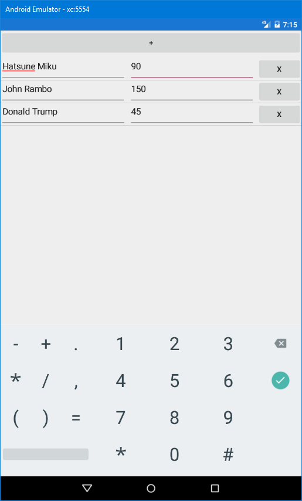
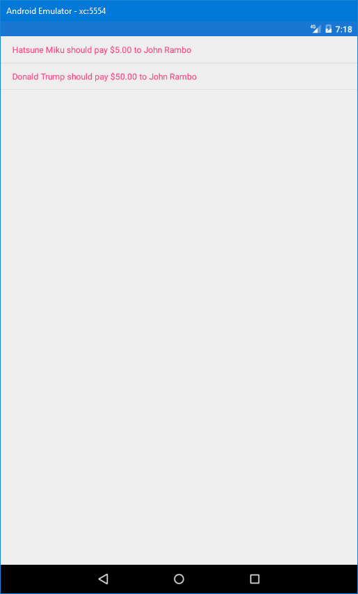

Rozliczenia
===========

Usual problem - you and your friends pay for drinks and pizza, but afterwards you need to figure out who needs to pay whom so everyone pays the same amount of money for the party. This apps solves that problem.

App in action
-------------

Disclaimer
----------

Yes, I know there exist apps for this already.

This one is open source and doesn't require Google Play Services installed.

The others have more features, so check them out.